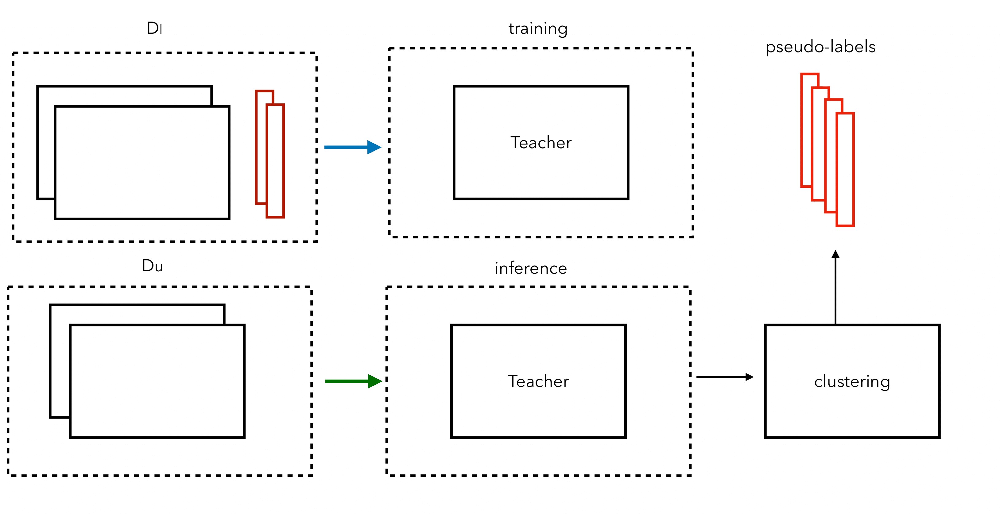

# ClustersDistillation

_Semi-supervised Time Series Classification through Clustering-based Self-supervision_

## Graphical Abstract

InverseTime: First we have the dataset with some labeled data. Then, the dataset is transformed by inverting all the series and assigning the pseudo-label 1 to the series in the original order and 0 to the inverted ones. Finally, a convolutional network layer is trained to solve the two tasks.

## Overview
Cluster Distillation: a technique that leverages all the available data (labeled or unlabeled) for training a deep time series classifier. The method relies on a self-supervised mechanism that generates surrogate labels that guide learning when external supervisory signals are lacking. We create that mechanism by introducing clustering into a \emph{Knowledge Distillation} framework in which a first neural net (the Teacher) transfers its beliefs about cluster memberships to a second neural net (the Student) which finally performs semi-supervised classification

## Runing Example

```
python ClustersDistillation.py -p 0.8 Wine
```
Where 0.8 is the unlabel porcentage and Wine is dataset

## Authors ✒️


* **Manuel Alejandro Goyo**
* **Ricardo Ñanculef** 
